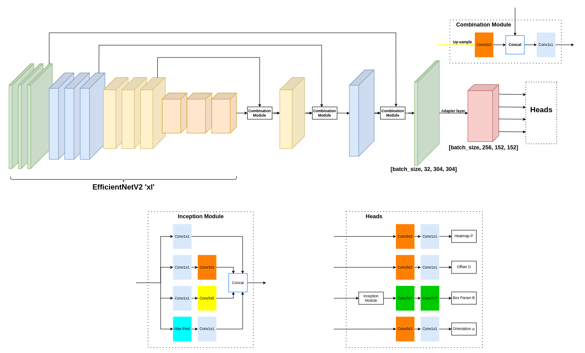

# Improving Oriented Object Detection in Aerial Images with Inception-Enhanced EfficientNetV2

As remote sensing and aerial imagery technologies rapidly evolve, the demand for highly accurate and efficient oriented object detection remains a prominent challenge. While current baseline models evaluated on the DOTA dataset provide a solid foundation, their performance often requires structural refinement for practical, high-precision applications. In this paper, we propose an optimized adaptation of the anchor-free BBAVectors framework. Specifically, we integrate the EfficientNetV2 backbone to enhance feature extraction and embed an Inception module into the Box Parameters prediction head to enable multi-scale spatial feature aggregation. Additionally, we introduce a task-specific heatmap pretraining strategy focused solely on object center localization, which effectively minimizes early-stage misclassification errors. Comprehensive experiments demonstrate that these targeted modifications collectively improve the mean Average Precision (mAP) on the DOTA dataset by 6.98% over the baseline method. Our findings underscore the distinct advantages of pairing advanced backbone architectures with specialized prediction heads and calibrated training protocols to achieve robust oriented object detection.

<p align="center">
	
</p>

# Validation Results on [DOTA-v1.0](https://captain-whu.github.io/DOTA/index.html)

The model weights can be downloaded from the following links: [Baseline](https://huggingface.co/datasets/lehoangan02/attempt1_batchsize15/resolve/main/model_48.pth), [Ours](https://huggingface.co/datasets/lehoangan02/attempt7_hm5/resolve/main/model_40.pth)

```ruby
## Baseline: model_48.pth
mAP: 0.6897542888248629
ap of each class: plane:89.75650831, baseball-diamond:72.88169122, bridge:45.61292098, ground-track-field:52.31153892, small-vehicle:73.39054686, large-vehicle:83.48699099, ship:88.12793968, tennis-court:90.89564282, basketball-court:67.51528891, storage-tank:88.14011661, soccer-ball-field:38.62730525, roundabout:69.64524465, harbor:63.18137214, swimming-pool:64.4452618, helicopter:46.61306409

## Ours: model_40.pth
mAP: 0.7334235773973964
ap of each class: plane:89.6967092, baseball-diamond:75.69345907, bridge:50.85142529, ground-track-field:68.06879174, small-vehicle:70.60914404, large-vehicle:83.9055576, ship:87.50747642, tennis-court:90.82852155, basketball-court:71.5196843, storage-tank:88.08672568, soccer-ball-field:68.00195632, roundabout:70.80480857, harbor:65.23533571, swimming-pool:64.29395758, helicopter:55.03181301
```


# Dependencies
Ubuntu 18.04, Python 3.6.10, PyTorch 1.6.0, OpenCV-Python 4.3.0.36 

# How To Start

Download and install the DOTA development kit [DOTA_devkit](https://github.com/lehoangan02/DOTA_devkit) and put it under datasets folder.

## GPU Notes
- Use a CUDA-enabled PyTorch build so `torch.cuda.is_available()` returns true.
- Weights are stored under `weights_<dataset>` inside `--save_dir` (default: `BBAV_SAVE_DIR`, then `/dev/shm` if writable, else current directory).
- Use `--pretrained` to download ImageNet weights for the backbone; use `--no-pretrained` on offline machines.
- Optional flags for debugging: `--heatmap_only` and `--phase loss` (see `--loss_epochs`).

## About DOTA

### Split Image
Split the DOTA images from [DOTA_devkit](https://github.com/lehoangan02/DOTA_devkit) before training, testing and evaluation.

The dota ```trainval``` and ```test``` datasets are cropped into ```608x608``` patches with a stride of `100` and two scales `0.5` and `1`.

### About Split TXT Files
The `trainval.txt` and `test.txt` used in `datasets/dataset_dota.py` contain the list of image names without suffix, example:
```
P0000__0.5__0___0
P0000__0.5__0___1000
P0000__0.5__0___1500
P0000__0.5__0___2000
P0000__0.5__0___2151
P0000__0.5__0___500
P0000__0.5__1000___0
```
Format of the ground-truth for DOTA dataset: `x1, y1, x2, y2, x3, y3, x4, y4, category, difficulty`

Examples: 
```
275.0 463.0 411.0 587.0 312.0 600.0 222.0 532.0 tennis-court 0
341.0 376.0 487.0 487.0 434.0 556.0 287.0 444.0 tennis-court 0
428.0 6.0 519.0 66.0 492.0 108.0 405.0 50.0 bridge 0
```
## Data Arrangement
### DOTA
```
data_dir/
        images/*.png
        labelTxt/*.txt
        trainval.txt
        test.txt
```
you may modify `datasets/dataset_dota.py` to adapt code to your own data.

## Quick GPU Sanity Check (Small Batch)
Create a tiny dataset subset (e.g. 5-20 images/labels) and update `trainval.txt`/`test.txt` to point to it. Then run:
```ruby
python main.py --data_dir dataPath --epochs 1 --batch_size 1 --dataset dota --phase train --save_dir ./runs --pretrained
# python main.py --data_dir dataPath --batch_size 1 --dataset dota --phase test --resume model_1.pth
python main.py --data_dir dataPath --conf_thresh 0.1 --batch_size 1 --dataset dota --phase eval --resume model_1.pth
```

## Train Model
```ruby
python main.py --data_dir dataPath --epochs 50 --batch_size 16 --dataset dota --phase train
```

<!-- ## Test Model
```ruby
python main.py --data_dir dataPath --batch_size 16 --dataset dota --phase test
``` -->

## Evaluate Model
```ruby
python main.py --data_dir dataPath --conf_thresh 0.1 --batch_size 16 --dataset dota --phase eval
```

You may change `conf_thresh` to get a better `mAP`. 

Please zip and upload the generated `merge_dota` for DOTA [Task1](https://captain-whu.github.io/DOTA/evaluation.html) evaluation.
